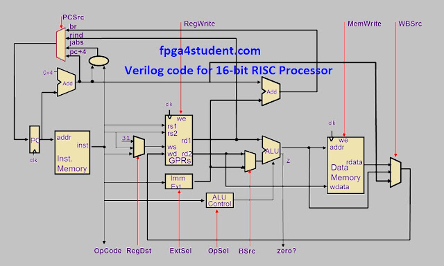
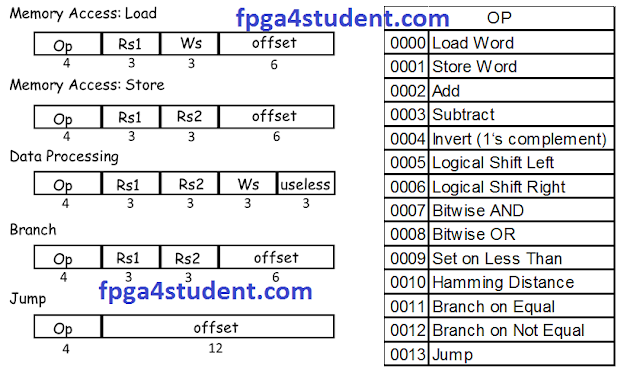

# Verilog Code for 16-bit RISC processor
based on
https://www.fpga4student.com/2017/04/verilog-code-for-16-bit-risc-processor.html

# Instruction Set

A. Memory Access Instructions
1. Load Word:  
    `LD ws, offset(rs1) ws:=Mem16[rs1 + offset]`
2. Store Word:  
    `ST rs2, offset(rs1) Mem16[rs1 + offset]=rs2`

B. Data Processing Instructions
1. Add:  
    `ADD ws, rs1, rs2 ws:=rs1 + rs2`
2. Subtract:  
    `SUB ws, rs1, rs2 ws:=rs1 – rs2`
3. Invert (1‘s complement):  
    `INV ws, rs1 ws:=!rs1`
4. Logical Shift Left:  
    `LSL ws, rs1, rs2 ws:=rs1 << rs2`
5. Logical Shift Right:  
    `LSR ws, rs1, rs2 ws:=rs1 >> rs2`
6. Bitwise AND:  
    `AND ws, rs1, rs2 ws:=rs1 • rs2`
7. Bitwise OR:  
    `OR ws, rs1, rs2 ws:=rs1 | rs2`
8. Set on Less Than:  
    `SLT ws, rs1, rs2 ws:=1 if rs1 < rs2; ws:=0 if rs1 ≥ rs2`

C. Control Flow Instructions
1. Branch on Equal:  
    `BEQ rs1, rs2, offset`
    `Branch to (PC + 2 + (offset << 1)) when rs1 = rs2`
2. Branch on Not Equal:  
    `BNE rs1, rs2, offset`
    `Branch to (PC + 2 + (offset << 1)) when rs1 != 
3. Jump:  
    `JMP offset Jump to {PC [15:13], (offset << 1)}`

# Processor Control Unit Design:
|Instruction|reg dst|ALU src|Memto reg|reg wr|mem rd|mem wr|branch|ALU op|Jump|
|:---------:|:-----:|:-----:|:-------:|:----:|:----:|:----:|:----:|:----:|:--:|
|data-proces|   1   |   0   |    0    |  1   |  0   |  0   |  0   |  00  | 0  |
|    LW     |   0   |   1   |    1    |  1   |  1   |  0   |  0   |  10  | 0  |
|    SW     |   0   |   1   |    0    |  0   |  0   |  1   |  0   |  10  | 0  |
| BEQ, BNE  |   0   |   0   |    0    |  0   |  0   |  0   |  1   |  01  | 0  |
|     J     |   0   |   0   |    0    |  0   |  0   |  0   |  0   |  00  | 1  |

# ALU Control Unit Design:
|ALU op|opcode|ALUcnt|ALU operation|instruction|
|:----:|:----:|:----:|:-----------:|:---------:|
|  10  | xxxx | 000  |     ADD     |   LW,SW   |
|  01  | xxxx | 001  |     SUB     |  BEQ,BNE  |
|  00  | 0002 | 000  |     ADD     |D-type: ADD|
|  00  | 0003 | 001  |     SUB     |D-type: SUB|
|  00  | 0004 | 010  |   INVERT    |D-type: INV|
|  00  | 0005 | 011  |     LSL     |D-type: LSL|
|  00  | 0006 | 100  |     LSR     |D-type: LSR|
|  00  | 0007 | 101  |     AND     |D-type: AND|
|  00  | 0008 | 110  |     OR      |D-type: OR |
|  00  | 0009 | 111  |     SLT     |D-type: SLT|

